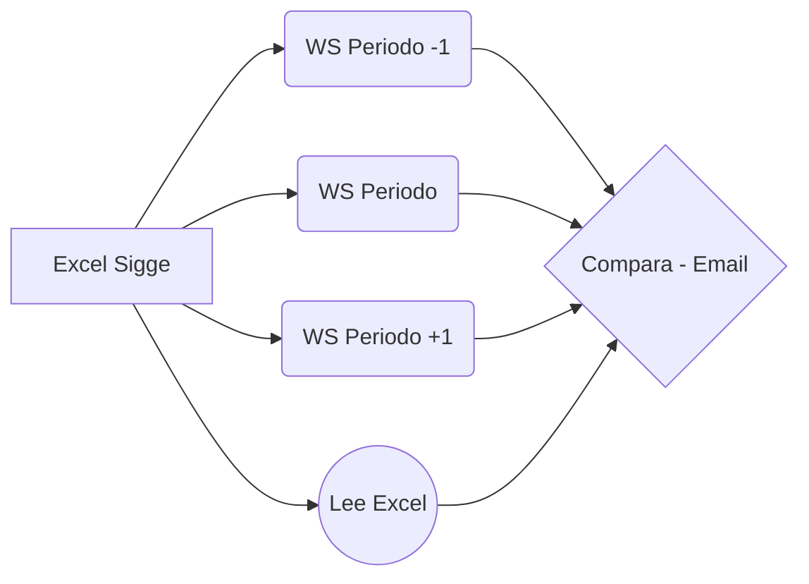

# DTE_ComparaArco
Consume API SOAP para verificar existencia de documentos.  Lee Excel con ExcelReader
# DTE_ComparaArco 

Compara los DTE autorizados por el CEN (plataforma Sigge) para su facturación contra los DTE’s emitidos por Arco por medio de la aplicación Facele.  Sí existen doctos. Informados en Sigge que no estén facturados los informará en un correo electrónico.

El proceso busca en in directorio de trabajo los archivos Excel Sigge con formato **alias__AAAA-MM.xls|xlsx**.  A partir de estos busca en el rango periodo-1 y periodo+1 los DTE's en Facele.  Una vez procesados mueve el archivo excel para evitar reprocesos.

# Archivos 

Archivos mínimos para instalación en ambiente **controlado**
* ArcoDTE_ComparaConfig.xml
* DTE_ComparaArco.exe
* DTE_ComparaArco.dll
* DTE_ComparaArco.deps.json
* DTE_ComparaArco.pdb
* DTE_ComparaArco.runtimeconfig.json
* ExcelDataReader.DataSet.dll
* ExcelDataReader.dll

Referencia:
> https://docs.microsoft.com/es-es/dotnet/core/tutorials/publishing-with-visual-studio

## Detalles de uso

* Uso de documento .XML para parámetros generales.  Nombre “ArcoDTE_ComparaConfig.Xml” que debe existir en el mismo directorio del ejecutable.
    * Opciones 
        * RutSociedades: Lista de sociedades a procesar.  Es un array de 3 posiciones, en donde la posición 0 es el Rut, la posición 1 es el nombre y posición 2 es el Alias (uso en nombre Excel)
            * Ejemplo: `12345678-9;Fundación Encordio;Encordio`
        * URIWEBService : URI Web Service de Facele
        * URISOAPAction : URI SOAP para header llamada http
        * SMTPName : nombre servidor smpt
        * SMTPPort: puerto utilizado
        * EnableSSL: Habilita conexión SSL (habitualmente en true)
        * EmailUser: Usuario de cuenta de correo
        * EmailPassword: Pass cuenta de correo
        * EmailTO: Dirección de correo Destinatario
        * EmailTO2: Dirección de correo Destinatario2 
        * DirectorioExcelSigge: Directorio de trabajo para archivos excel Sigge
* El input de datos se Leen desde archivos Excel con formato **Alias__AAAA-MM.xls o Alias__AAAA-MM.xlsx**, donde:
    * Alias: Alias empresa 
    * AAAA-MM: Periodo de proceso 
* Los archivos Excel deben ser alojados en el directorio de trabajo especificado en el documento XML de parámetros (setting: DirectorioExcelSigge).  Si no existe, revisará el directorio actual.
* Los datos de los DTE son leídos desde API SOAP de la empresa Facele.  Ojo no es una url pública sino una especifica que debe ser invocada desde un servidor especifico, en donde se debe alojar la App.
* Genera archivo log diario con información de ejecución y archivos encontrados.  Se aloja en directorio de la app.
* Su output es un Email con los DTE de Sigge que no encontró en Facele, sólo si existen dichas diferencias. **Si Email falla, dejará archivo Html en directorio Sigge con resultado (revisar log para posibles problemas).**

Diagrama:

